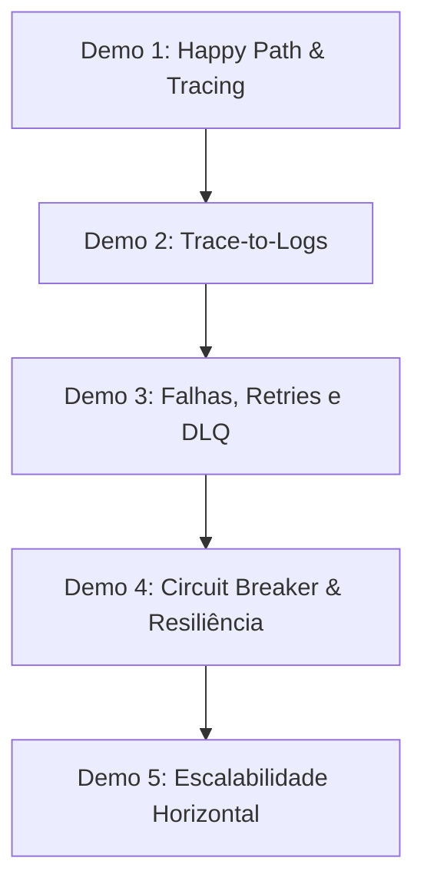

# 🎓 Roteiro de Aula Prática (Runbook) — Observabilidade e Mensageria

Este documento serve como um guia/roteiro passo a passo para o instrutor conduzir a aula prática de **Arquitetura de Microsserviços** e **Engenharia de Dados** utilizando a stack composta por **Docker Compose, Flask, RabbitMQ, PostgreSQL, Prometheus, Loki, Tempo e Grafana**.

---

## 📋 Preparação Inicial (Antes da Aula)

Antes de iniciar a demonstração para os alunos, certifique-se de que o ambiente está limpo e rodando perfeitamente.

```bash
# 1. Acesse o diretório do projeto de infraestrutura
cd ~/Developer/logs-with-loki

# 2. Garanta que o arquivo .env existe e possui as senhas padrão
# (Se não existir, copie do .env.example)
# GRAFANA_PASSWORD=testloki
# RABBITMQ_PASSWORD=passw123

# 3. Suba a infraestrutura completa
docker compose up -d --build
```

### URLs e Acessos Rápidos para o Instrutor
*   **Grafana:** [http://localhost:3000](http://localhost:3000) (admin / `testloki`)
*   **RabbitMQ Management:** [http://localhost:15672](http://localhost:15672) (admin / `passw123`)
*   **Prometheus:** [http://localhost:9090](http://localhost:9090)
*   **API REST (Swagger/Endpoints):** [http://localhost:5000/messages](http://localhost:5000/messages)

### 📬 Collection do Postman Disponível
Você e seus alunos podem usar a Collection do Postman pré-configurada para testar todas as rotas da API:
*   Localização no repositório: [docs/Postman_Collection.json](file:///Users/manza/Developer/logs-with-loki/docs/Postman_Collection.json)
*   **Instruções de uso:** Abra o Postman -> Clique em **Import** -> Selecione o arquivo `Postman_Collection.json`.
*   A collection já possui script automático de teste que captura o `correlationId` retornado na chamada de escrita (POST) e o injeta como variável de ambiente (`lastCorrelationId`) para a busca síncrona (FindByCorrelationId).

---

## 🚀 Roteiro de Demonstrações (Live Demos)



---

### 🟢 Demo 1: O Fluxo Feliz (Happy Path) & Tracing Distribuído
**Objetivo:** Mostrar uma requisição HTTP síncrona gerando um processamento assíncrono que persiste no banco de dados e é rastreado de ponta a ponta.

1.  **Faça uma chamada POST na API REST:**
    Abra a collection importada no Postman e dispare a requisição **"Publish Message (Pub/Sub Fanout)"**.
    *   *Ou utilize o curl via terminal:*
    ```bash
    curl -X POST http://localhost:5000/message \
      -H "Content-Type: application/json" \
      -d '{"name": "Mensagem Didatica", "messageNumber": 101}'
    ```
    *   **Explicação para a turma:** A API recebe o payload síncrono, gera um `correlationId` (ID de Negócio) e um `traceId` (ID Técnico) via OpenTelemetry, e coloca a mensagem na fila do RabbitMQ, respondendo `200 OK` imediatamente.

2.  **Verifique a persistência no PostgreSQL:**
    No Postman, dispare a requisição **"Get All Messages (Postgres)"**. Ela deve listar a mensagem enviada:
    ```bash
    curl -s http://localhost:5000/messages | json_pp
    ```

3.  **Abra o Grafana:**
    *   Vá em **Explore** -> Escolha **Tempo** como Datasource.
    *   Em Query Type, mude para **Search** ou digite a consulta do Span.
    *   Ou clique no link direto gerado no dashboard pré-configurado **Microservices Observability**.
    *   **O que mostrar:** A árvore (waterfall) de spans mostrando a latência de cada etapa:
        1.  `POST /message` (Flask API)
        2.  `rabbitmq_publish` (RabbitMQ Producer)
        3.  `rabbitmq_consume` (RabbitMQ Consumer)
        4.  `process_message_logic` (Simulação de cálculo do consumer)
        5.  `SQL INSERT` (Persistência via SQLAlchemy)

---

### 🔍 Demo 2: Navegabilidade Cruzada (Trace-to-Logs)
**Objetivo:** Demonstrar a correlação de dados (o maior poder da observabilidade moderna). Encontrar um erro no log e ir para o trace, ou vice-versa.

1.  **No Grafana, vá em Explore -> Loki:**
    *   Execute a query: `{job="dockerlogs", is_app="true"}`
    *   Expanda qualquer linha de log da API ou do Consumer.
    *   **Mostre o Link:** Veja que o Grafana extrai o `traceId` do JSON estruturado do log e exibe um botão azul: **"🔍 Debug: View Technical Trace"** ou **"Tempo"**.
    *   Clique no botão. A tela se dividirá (split screen), mostrando o log à esquerda e o gráfico de Gantt do trace à direita.
    *   **Explicação para a turma:** "Isso reduz o tempo de descoberta de incidentes (MTTD) de horas para segundos, pois você não precisa buscar logs manualmente em arquivos diferentes usando IDs distintos."

---

### 🟡 Demo 3: Resiliência em Mensageria (Retries, Backoff Exponencial e DLQ)
**Objetivo:** Demonstrar como microsserviços lidam com falhas transientes e permanentes sem perder dados.

1.  **Explique a falha simulada:**
    *   Mostre no arquivo [consumer.py](file:///Users/manza/Developer/python-api/consumer.py#L41-L45) que há um fator randômico de 50% de erro intencional (`ValueError("Simulated processing failure")`).

2.  **Envie uma mensagem e acompanhe os logs em tempo real:**
    ```bash
    # No terminal de logs do consumer:
    docker compose logs -f consumer
    ```
    *   **O que ver nos logs:**
        *   `Attempt 1/3 failed. Retrying in 0.5s...`
        *   `Attempt 2/3 failed. Retrying in 1.0s...`
        *   `Attempt 3/3 failed. Retrying in 2.0s...`
        *   *(Se falhar a 4ª vez consecutiva)* -> `Message failed after 3 retries. Sending to DLQ.`
    *   **Explicação para a turma:** O Backoff Exponencial evita sobrecarregar os sistemas downstream (como o banco de dados) que podem estar temporariamente indisponíveis.

3.  **Mostre o RabbitMQ Management Portal:**
    *   Acesse `http://localhost:15672` (admin/passw123).
    *   Vá na aba **Queues**.
    *   Mostre a fila `logs_dlq`. Se a mensagem falhou todas as vezes, ela estará lá estacionada para análise manual (Dead Letter Queue).
    *   Explique a importância da DLQ: dados críticos de negócio nunca devem ser descartados silenciosamente em caso de erro de código.

---

### 🔴 Demo 4: Autoproteção de Sistemas (Circuit Breaker)
**Objetivo:** Demonstrar como impedir falhas em cascata quando um recurso crítico (RabbitMQ) cai completamente.

1.  **Simule a queda do Message Broker:**
    ```bash
    docker compose stop rabbitmq
    ```

2.  **Verifique o Health Check da API (Readiness Probe):**
    No Postman, dispare **"Readiness Probe"**.
    *   *Ou via terminal:*
    ```bash
    curl -i http://localhost:5000/health/ready
    ```
    *   **O que vai retornar:** `503 Service Unavailable`.
    *   O JSON mostrará: `"rabbitmq": "DOWN"`, e o status do Circuit Breaker estará `"closed"` (mas pronto para abrir com requisições falhas).

3.  **Dispare 3 requisições seguidas no Postman para forçar a abertura do circuito:**
    Envie 3 vezes a requisição **"Publish Message"** consecutivas (ou use o terminal):
    ```bash
    curl -X POST http://localhost:5000/message -H "Content-Type: application/json" -d '{"name":"erro"}'
    curl -X POST http://localhost:5000/message -H "Content-Type: application/json" -d '{"name":"erro"}'
    curl -X POST http://localhost:5000/message -H "Content-Type: application/json" -d '{"name":"erro"}'
    ```

4.  **Consulte novamente o Health Check:**
    Dispare o **"Readiness Probe"** novamente.
    *   **O que mudou:** O campo `"circuit_breaker"` agora deve estar como `"open"`.
    *   **Explicação para a turma:** O Circuit Breaker abriu! A partir de agora, qualquer requisição POST para `/message` retorna erro `503` instantaneamente **sem sequer tentar se conectar ao RabbitMQ**, evitando desperdício de threads, memória e timeout na API REST.

5.  **Restaure o serviço e observe a recuperação automática (Half-Open -> Closed):**
    ```bash
    docker compose start rabbitmq
    ```
    *   Aguarde os 30 segundos (`reset_timeout` definido no código).
    *   Faça uma chamada POST. O circuito irá para o estado `half-open`, testará a conexão com sucesso e voltará a ficar `closed`.

---

### 🔵 Demo 5: Escalabilidade Horizontal & Teste de Carga
**Objetivo:** Mostrar o balanceamento de carga nativo do RabbitMQ com múltiplos workers em paralelo e como isso é visualizado em métricas de hardware e throughput.

1.  **Escile os consumers para 3 réplicas:**
    ```bash
    docker compose up -d --scale consumer=3
    ```

2.  **Verifique a contagem de réplicas no Prometheus / Grafana:**
    *   Abra o dashboard no Grafana.
    *   O gauge **"Consumer Replicas"** sairá de `1` para `3`.

3.  **Execute o script de teste de carga localmente:**
    O script envia 1000 mensagens com delay de 50ms (simulando concorrência real).
    ```bash
    # Acesse o diretório do projeto python-api e execute o script
    cd ~/Developer/python-api
    python test_load.py
    ```

4.  **O que mostrar no Dashboard do Grafana:**
    *   O painel **"Consumer Message Throughput"** exibirá três linhas distintas (uma para cada IP/container replica).
    *   Mostre como o RabbitMQ faz o balanceamento em Round-Robin (distribuição equilibrada entre as réplicas).
    *   Mostre as métricas de hardware do **cAdvisor** exibindo o consumo de CPU subindo proporcionalmente nos containers dos consumers ativos.

---

## 🧹 Limpeza pós-aula

Ao final da aula, ensine os alunos a limparem o ambiente para não consumir recursos da máquina local:

```bash
# Derruba os containers e limpa os volumes criados (Postgres, Grafana local storage)
docker compose down -v
```
