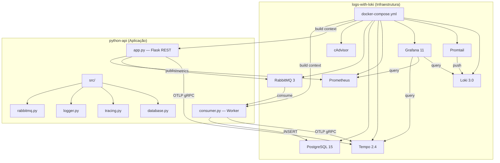

# 🔬 Avaliação dos Workspaces — Aula de Arquitetura de Microsserviços

## Visão Geral

Dois repositórios complementares formam o laboratório:

| Repositório | Papel | Conteúdo |
|---|---|---|
| **logs-with-loki** | Infraestrutura (IaC) | Docker Compose + configs de Loki, Promtail, Grafana, Prometheus, Tempo, RabbitMQ, PostgreSQL, cAdvisor |
| **python-api** | Aplicação (código de negócio) | Flask API + Consumer RabbitMQ + módulos de logging, tracing, database, resiliência |

---

## ✅ Mapeamento: README → Implementação

Abaixo, cada tópico listado no README do `logs-with-loki` e o status real no código:

### 1. Logs centralizados com Loki + Promtail + Grafana
| Aspecto | Status | Detalhes |
|---|---|---|
| Logger JSON estruturado | ✅ Implementado | [logger.py](file:///Users/manza/Developer/python-api/src/logger.py) — usa `logging_json.JSONFormatter` com campos `traceId`, `spanId`, `correlationId` |
| Promtail pipeline | ✅ Completo | [promtail-config.yaml](file:///Users/manza/Developer/logs-with-loki/config/loki/promtail-config.yaml) — 6 stages: parse JSON Docker → parse app JSON → template `is_app` → labels → structured_metadata → output |
| Separação app vs infra | ✅ Elegante | Label `is_app=true/false` permite filtrar ruído de infraestrutura no Grafana |
| Loki config | ✅ Adequado | [loki-config.yaml](file:///Users/manza/Developer/logs-with-loki/config/loki/loki-config.yaml) — TSDB + schema v13 + filesystem storage |

### 2. Distributed Tracing com Grafana Tempo
| Aspecto | Status | Detalhes |
|---|---|---|
| OpenTelemetry SDK | ✅ Implementado | [tracing.py](file:///Users/manza/Developer/python-api/src/tracing.py) — `TracerProvider` + `OTLPSpanExporter` → Tempo |
| Auto-instrumentação Flask | ✅ | `FlaskInstrumentor().instrument_app(app)` |
| Auto-instrumentação SQLAlchemy | ✅ | `SQLAlchemyInstrumentor().instrument()` |
| Propagação de contexto RabbitMQ | ✅ | Injeção W3C no publish ([rabbitmq.py:126-127](file:///Users/manza/Developer/python-api/src/rabbitmq.py#L126-L127)), extração no consume ([consumer.py:51](file:///Users/manza/Developer/python-api/consumer.py#L51)) |
| Spans manuais no consumer | ✅ | `tracer.start_as_current_span("process_message_logic")` com atributos de negócio |

### 3. Trace-to-Logs (correlationId)
| Aspecto | Status | Detalhes |
|---|---|---|
| Loki → Tempo | ✅ | [loki-datasource.yml](file:///Users/manza/Developer/logs-with-loki/config/grafana/provisioning/datasources/loki-datasource.yml) — 2 derived fields: `traceId` (técnico) e `correlationId` (negócio) |
| Tempo → Loki | ✅ | [tempo.yml](file:///Users/manza/Developer/logs-with-loki/config/grafana/provisioning/datasources/tempo.yml) — `tracesToLogsV2` com custom query filtrando por `correlationId` |
| Atributo no Span | ✅ | `current_span.set_attribute("messaging.correlation_id", ...)` no [app.py:61](file:///Users/manza/Developer/python-api/app.py#L61) e [consumer.py:61](file:///Users/manza/Developer/python-api/consumer.py#L61) |

### 4. Métricas de aplicação (Prometheus)
| Aspecto | Status | Detalhes |
|---|---|---|
| Contadores API | ✅ | `http_requests_total`, `messages_published_total`, `tasks_published_total` |
| Contadores Consumer | ✅ | `messages_processed_total`, `messages_processing_errors_total` |
| Endpoint `/metrics` | ✅ | Expõe via `prometheus_client.generate_latest()` |
| Consumer metrics server | ✅ | `start_http_server(8000)` para scrape separado |
| Contadores Task Consumer | ✅ | `tasks_processed_total`, `task_processing_errors_total` no job `task-consumers` (porta 8001), com painéis de replicas/throughput no dashboard |

### 5. Métricas de infraestrutura (cAdvisor)
| Aspecto | Status | Detalhes |
|---|---|---|
| Container cAdvisor | ✅ | CPU + RAM por container via Prometheus scrape |
| Dashboard panels | ✅ | "CPU Usage per Container" e "Memory Usage per Container" no [microservices.json](file:///Users/manza/Developer/logs-with-loki/config/grafana/provisioning/dashboards/microservices.json) |
| Métricas RabbitMQ | ✅ | Job `rabbitmq` no Prometheus (`/metrics/per-object`, porta 15692) + painel "RabbitMQ Queue Metrics" (`rabbitmq_queue_messages_ready` por fila) |

### 6. Persistência SQL (PostgreSQL)
| Aspecto | Status | Detalhes |
|---|---|---|
| Model SQLAlchemy | ✅ | [database.py](file:///Users/manza/Developer/python-api/src/database.py) — tabela `messages` com `correlation_id`, `name`, `message_number`, `created_at` |
| CRUD | ✅ | `save_message`, `get_all_messages`, `get_message_by_correlation_id`, `check_db_connection` |
| Endpoints REST | ✅ | `GET /messages` (FindAll), `GET /messages/<id>` (FindByCorrelationId) |

### 7. Comunicação assíncrona (RabbitMQ)
| Aspecto | Status | Detalhes |
|---|---|---|
| Pub/Sub (Fanout) | ✅ | Exchange `logs` → `POST /message` broadcast para todos consumers |
| Work Queue (Direct) | ✅ | Exchange `tasks` → `POST /task` round-robin para 1 worker |
| DLQ | ✅ | Exchange `logs_dlx` → Queue `logs_dlq` — nack sem requeue envia para DLQ |
| Retry c/ Backoff | ✅ | 3 tentativas, delay exponencial 0.5s → 1s → 2s |
| Idempotência | ✅ | Cache in-memory `processed_messages` (set) verifica `correlationId` |

### 8. Resiliência (Circuit Breaker)
| Aspecto | Status | Detalhes |
|---|---|---|
| pybreaker | ✅ | [rabbitmq.py:15-18](file:///Users/manza/Developer/python-api/src/rabbitmq.py#L15-L18) — `fail_max=3`, `reset_timeout=30s` |
| Integração API | ✅ | `except pybreaker.CircuitBreakerError` → 503 imediato |
| Estado no health check | ✅ | `/health/ready` retorna `circuit_breaker` state |

### 9. Health Checks (Liveness + Readiness)
| Aspecto | Status | Detalhes |
|---|---|---|
| Liveness | ✅ | `GET /health/live` → sempre 200 (container está rodando) |
| Readiness | ✅ | `GET /health/ready` → verifica RabbitMQ + PostgreSQL + Circuit Breaker state |

---

## 💪 Pontos Fortes para a Aula

1. **Separação clara infra vs app** — O aluno entende que a infraestrutura (observabilidade, broker, banco) vive em um repo e a lógica de negócio em outro. Isso reflete bem o mundo real.

2. **Tudo sobe com um comando** — `docker compose up -d` no `logs-with-loki` builda e sobe 10 serviços. Zero configuração manual.

3. **Grafana provisionado automaticamente** — Datasources (Loki, Prometheus, Tempo) e um dashboard "Microservices Observability" já vêm pré-configurados. O aluno abre o Grafana e já tem dados.

4. **Fluxo end-to-end completo** — `curl POST /message` → API gera correlationId → publica no RabbitMQ → Consumer consome → retry com backoff → persiste no PostgreSQL. Todo o fluxo tem trace no Tempo e log no Loki.

5. **Falha simulada didática** — O consumer tem 50% de chance de falhar (`random.random() < 0.5`), garantindo que em aula o aluno sempre verá o caminho de DLQ, retry e erro.

6. **Script de carga** — [test_load.py](file:///Users/manza/Developer/python-api/test_load.py) envia 1000 mensagens para demonstração de throughput e enchimento de DLQ.

7. **Dois padrões de messaging** — Pub/Sub vs Work Queue num mesmo projeto é excelente para comparação didática.

8. **Prometheus DNS Service Discovery** — [prometheus.yml](file:///Users/manza/Developer/logs-with-loki/config/prometheus/prometheus.yml#L9-L14) usa `dns_sd_configs` para consumers, então `--scale consumer=N` funciona automaticamente para métricas.

---

## ⚠️ Problemas e Lacunas Identificados

### Críticos (resolvidos)

| # | Problema | Impacto | Localização |
|---|---|---|---|
| 3 | ✅ **cAdvisor no macOS — resolvido** | O container cAdvisor monta `/sys`, `/dev/disk`, `/dev/kmsg` e usa `privileged: true`, paths que **não existem no macOS** da mesma forma. **Mitigação:** seção "Limitações conhecidas" no README + template [docker-compose.override.yml.example](file:///Users/manza/Developer/logs-with-loki/docker-compose.override.yml.example) que desativa cAdvisor em dev. | [docker-compose.yml:75-89](file:///Users/manza/Developer/logs-with-loki/docker-compose.yml#L75-L89) |

### Melhorias Didáticas

| # | Sugestão | Justificativa |
|---|---|---|
| 6 | **Idempotência in-memory não sobrevive a restart** | O `processed_messages = set()` perde tudo se o container reinicia. Excelente para explicar em aula: "Em produção, usaria Redis ou consulta no Postgres". Está comentado no código mas vale reforçar na aula. |
| 7 | ✅ **Work Queue sem consumer — resolvido** | Foi criado [task_consumer.py](file:///Users/manza/Developer/python-api/task_consumer.py) + serviço `task-consumer` no [docker-compose.yml](file:///Users/manza/Developer/logs-with-loki/docker-compose.yml), que consume a `tasks_queue` com round-robin. Pub/Sub e Work Queue agora têm consumers próprios; métricas do task consumer (porta 8001) com painel de replicas/throughput no dashboard. |
| 8 | **Dockerfile CMD usa `flask run`** mas o `app.py` usa `app_instance.run()` | O CMD do Dockerfile chama `flask run` que precisa da env var `FLASK_APP=app`. Porém o tracing e init_db são feitos dentro de `create_app()` chamado pelo `if __name__`. Com `flask run`, o Flask usa a factory automaticamente se encontra `create_app()`, então funciona — mas vale confirmar. |
| 9 | ✅ **Sem `__init__.py` no `src/` — resolvido** | [__init__.py](file:///Users/manza/Developer/logs-with-loki/python-api/src/__init__.py) criado — `src/` agora é um pacote regular, eliminando problemas de import em algumas versões do Python. |
| 10 | ✅ **Dashboard sem panel de DLQ — resolvido** | Adicionados painéis **"DLQ & Errors"** (taxa de erros agregada com `sum(rate(...))`) e **"RabbitMQ Queue Metrics"** (`rabbitmq_queue_messages_ready` por fila via `/metrics/per-object`). |
| 11 | ✅ **Sem exemplo de `docker-compose.override.yml` — resolvido** | [docker-compose.override.yml.example](file:///Users/manza/Developer/logs-with-loki/docker-compose.override.yml.example) criado (ex.: desativar cAdvisor no macOS). |

---

## 📊 Cobertura de Conceitos para Data Engineering

Mapeamento dos conceitos que a turma verá neste lab versus conceitos adicionais que poderiam ser discutidos:

### ✅ Cobertos pelo Lab

| Conceito | Onde ver na prática |
|---|---|
| API REST (CRUD) | `POST /message`, `GET /messages`, `GET /messages/<id>` |
| Producer / Consumer | `app.py` → RabbitMQ → `consumer.py` |
| Pub/Sub vs Work Queue | Exchange `fanout` vs `direct` |
| Dead Letter Queue | `logs_dlx` + `logs_dlq` |
| Retry com Backoff Exponencial | `consumer.py` loop com `delay *= 2` |
| Circuit Breaker | `pybreaker` no `rabbitmq.py` |
| Idempotência | Cache por `correlationId` |
| Logs estruturados (JSON) | `logger.py` + Promtail pipeline |
| Métricas (RED) | Counters Prometheus via `/metrics` |
| Distributed Tracing | OpenTelemetry → Tempo |
| Correlation ID (rastreabilidade) | UUID gerado na API, propagado até o DB |
| Health Checks (Liveness/Readiness) | `/health/live`, `/health/ready` |
| Persistência relacional | PostgreSQL + SQLAlchemy |
| Containerização | Docker + Docker Compose |
| Observabilidade (3 pilares) | Logs (Loki) + Metrics (Prometheus) + Traces (Tempo) |
| Escalabilidade horizontal | `--scale consumer=N` + DNS SD no Prometheus |

### ❌ Não Cobertos (oportunidades de extensão)

| Conceito | Como adicionar |
|---|---|
| API Gateway / Load Balancing | Nginx/Traefik na frente da API |
| Service Discovery | Consul / etcd |
| Config centralizada | Vault / ConfigMap |
| Event Sourcing | Kafka como event store |
| CQRS | Separar modelo de escrita (consumer) e leitura (query API) |
| Schema Registry | Avro schemas para mensagens |
| Rate Limiting | Flask-Limiter |

---

## 🛠️ Recomendações Prioritárias

> [!IMPORTANT]
> ✅ **Todos os itens foram resolvidos — laboratório pronto para a aula.**

1. ✅ **Consumer da Work Queue** — criado `task_consumer.py` + serviço `task-consumer`
2. ✅ **cAdvisor no macOS** — nota "Limitações conhecidas" no README + `docker-compose.override.yml.example`
3. ✅ **Painel de DLQ/Errors e filas RabbitMQ** — painéis "DLQ & Errors" e "RabbitMQ Queue Metrics" no dashboard
